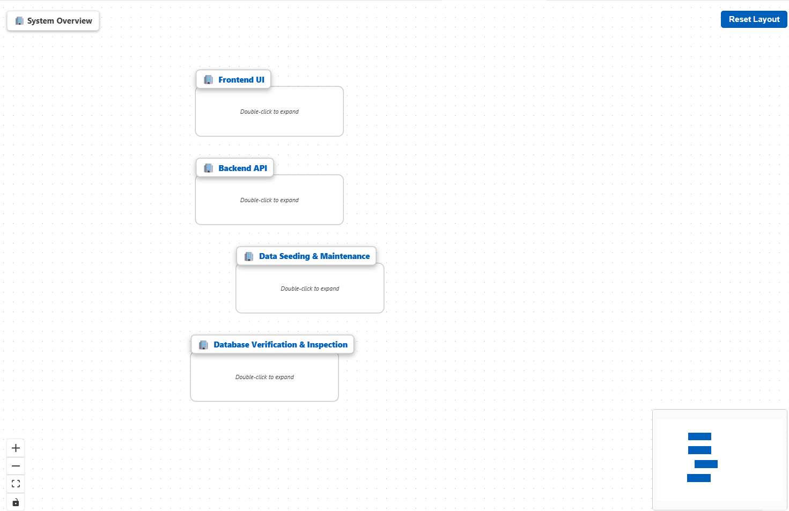
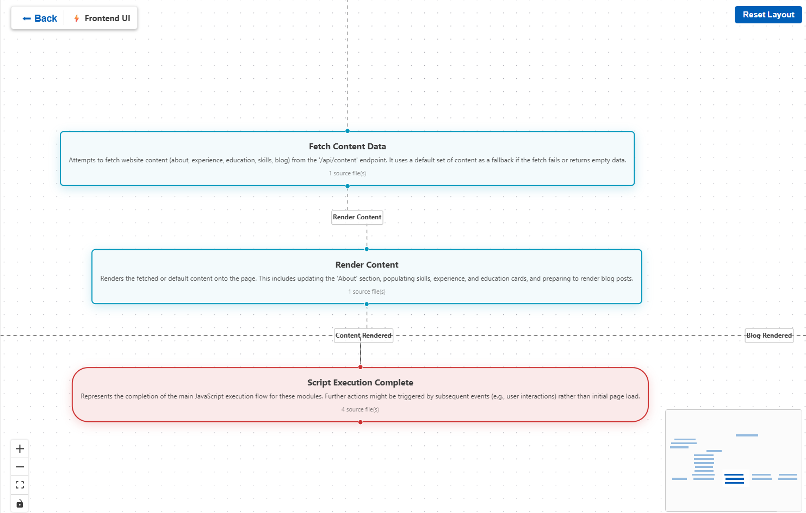
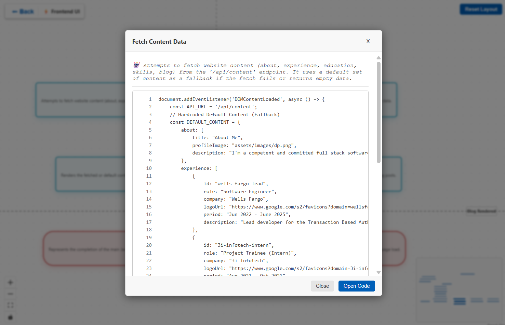
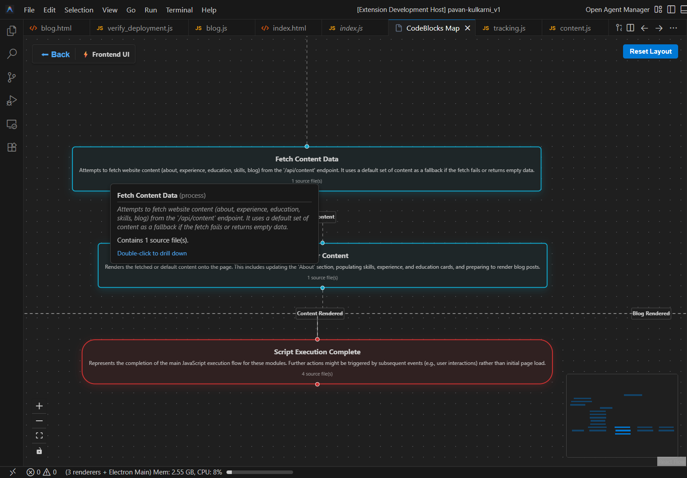

<!--
Copyright 2026 Pavan Kulkarni

Licensed under the Apache License, Version 2.0 (the "License");
you may not use this file except in compliance with the License.
You may obtain a copy of the License at

    http://www.apache.org/licenses/LICENSE-2.0

Unless required by applicable law or agreed to in writing, software
distributed under the License is distributed on an "AS IS" BASIS,
WITHOUT WARRANTIES OR CONDITIONS OF ANY KIND, either express or implied.
See the License for the specific language governing permissions and
limitations under the License.
-->

# CodeBlocks Visualization 🚀
**`Ctrl`+`P` `Ctrl`+`K`** to toggle CodeBlock

CodeBlocks is a powerful VS Code/Antigravity extension that **visualizes your codebase** using generic intelligence. It moves beyond static class diagrams to generate **Conceptual Architecture Maps**, **Process Flows**, and **Component Graphs** on the fly.

## ✨ Key Features (Current)

### 1. 🧠 AI-Powered Architecture Inference
CodeBlocks doesn't just parse files; it **understands** them.
*   **Conceptual Map**: Automatically groups files into logical subsystems (e.g., "Authentication", "Data Layer", "UI Components") rather than just showing folder trees.
*   **Process Flows**: Visualizes how data flows through your system (e.g., "User Login Flow").

### 2. 🔍 Hierarchical Drill Down
Navigate your code from 10,000 feet down to the metal.
*   **Level 0 (System View)**: See high-level modules and how they interact.
*   **Level 1 (Process Flow)**: Double-click a module to see its internal process steps.
*   **Level 2 (Deep Drill Down)**: Double-click any process step to generate a **detailed component graph** (classes/functions) for just that specific step.

### 3. ⚡ Interactive Edge Navigation
Understand the connections.
*   **Call Graphs**: Arrows represent actual function calls and references.
*   **Jump to Code**: **Double-click any arrow (Edge)** to instantly open your editor at the exact line of code where the call happens.

### 4. 🎨 Native VS Code/Antigravity Integration
*   **Theme Aware**: Fully supports Light, Dark, and High Contrast themes. The graph feels like a native part of VS Code/Antigravity.
*   **Live Updates**: The graph updates as you explore.

## 📸 Visuals

| Feature | Screenshot |
| :--- | :--- |
| **System Overview** |  |
| **Drill Down** |  |
| **Interactive Graph** |  |
| **Dark Mode Compatability** |  |

## 🔮 Scope for Future Enhancements

We are working on exciting new capabilities to transform CodeBlocks into a full-cycle development tool:

### 1. Flowchart → Code (Low/No Code Solution)
Turn your diagrams into working software.
*   **Drag & Drop Interface**: Visually design your application logic using flowchart elements.
*   **Code Generation**: Automatically generate boilerplate and logic code in your preferred language from your visual design.

### 2. Code Translate
Break down language barriers.
*   **One-Click Translation**: Translate entire code modules from one language (e.g., Python) to another (e.g., TypeScript) instantly.
*   **Context Aware**: Preserves logic, variable names, and architectural patterns during translation.

## 🚀 Getting Started

1.  **Open a Folder** in VS Code/Antigravity.
2.  Run the command **`CodeBlocks: Open Graph`**.
3.  Wait for the AI to analyze your workspace.
4.  **Explore**:
    *   **Double-click nodes** to drill down or expand.
    *   **Double-click edges** to jump to source code.
    *   **Right-click -> Reset Layout** to fix the view.

## 🛠️ Configuration

*   **`codeblocks.ignoredFolders`**: List of folders to exclude from analysis (default: `node_modules`, `dist`, etc.).

## 🤝 Contributing & Support

This project is open for contributions! whether it's a bug fix, new feature, or documentation improvement.

*   **GitHub Repository**: [https://github.com/pkulkarni245/codeblock-vsix](https://github.com/pkulkarni245/codeblock-vsix)
*   **Report Issues**: Please invoke the GitHub issue tracker (link above).

### Contact the Author
For enterprise inquiries or just to say hi:
[**Visit Pavan Kulkarni**](https://pavankulkarni.com/?utm_source=markdown&utm_campaign=codeblocks)

## ⚖️ Privacy & Disclaimer

**Data Privacy**: CodeBlocks (this extension) **does not collect, store, or transmit any of your code or personal data** to our own servers. All analysis happens locally or through the LLM provider you configure.

**LLM Usage**: This extension relies on Large Language Models (e.g., OpenAI, Anthropic, Gemini) to perform architectural inference.
*   **Caution**: When you use this tool, snippets of your codebase (structure, file names, and summaries) are sent to the configured LLM provider for analysis.
*   **Third-Party Policies**: We cannot guarantee how these third-party LLM providers handle your data. Please review their respective privacy policies and terms of service before using this extension with sensitive or proprietary code.
*   **No Warranty**: This tool is provided "as is" without warranty of any kind. The authors are not responsible for any data leaks or issues arising from the use of third-party AI services.

## 📄 License
This project is licensed under the Apache License 2.0 - see the LICENSE file for details.

---
*Built by Pavan with ❤️ for Developers.*
